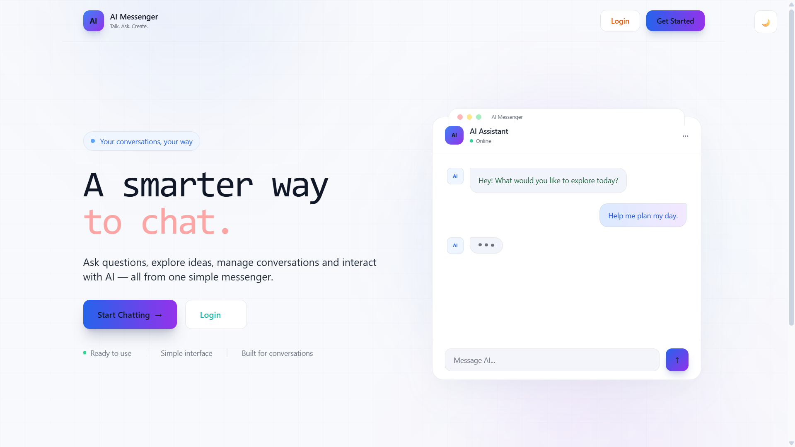
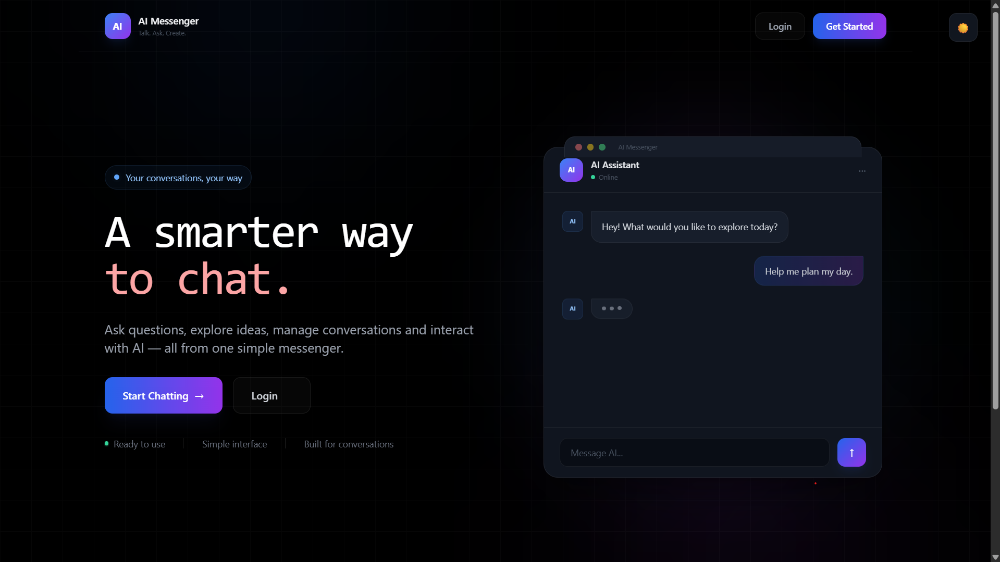
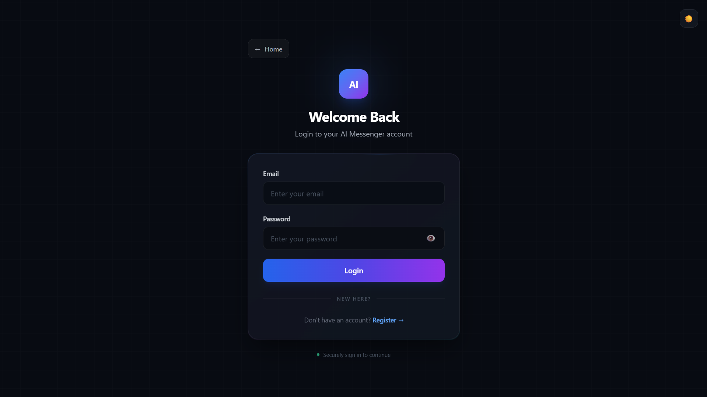
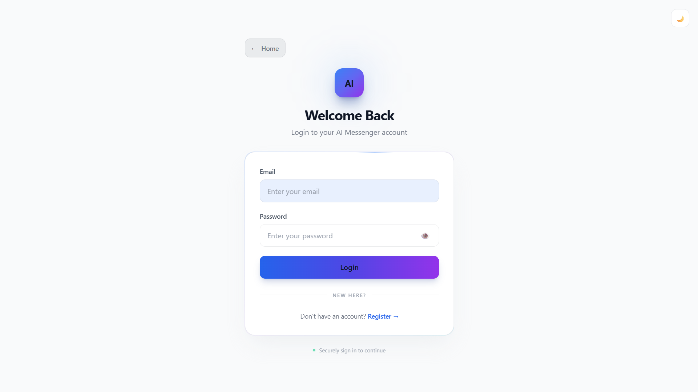
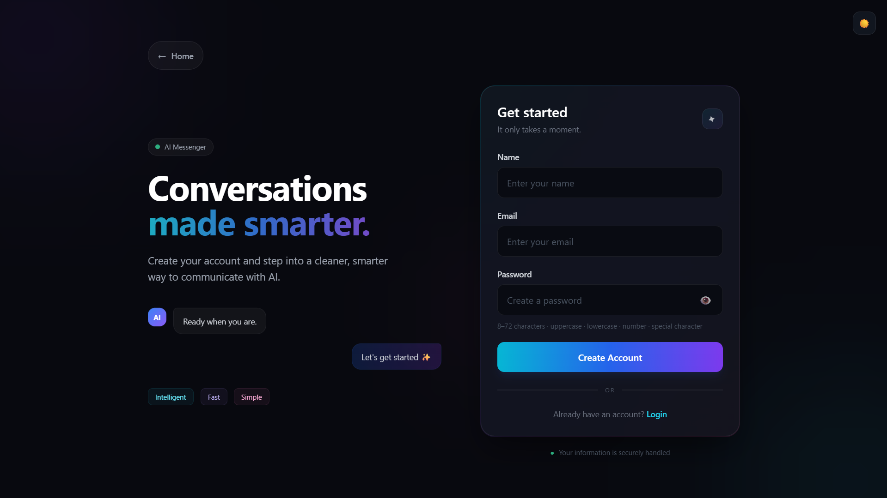
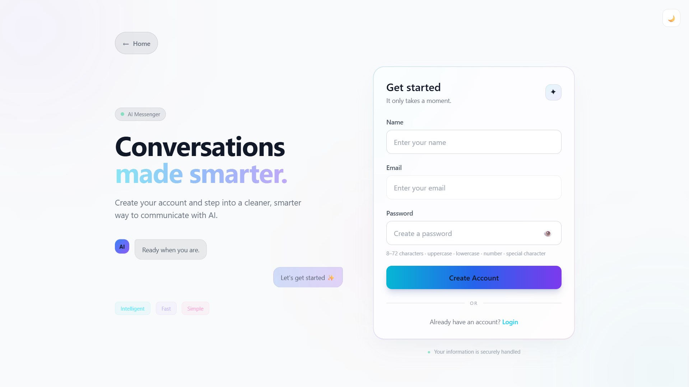
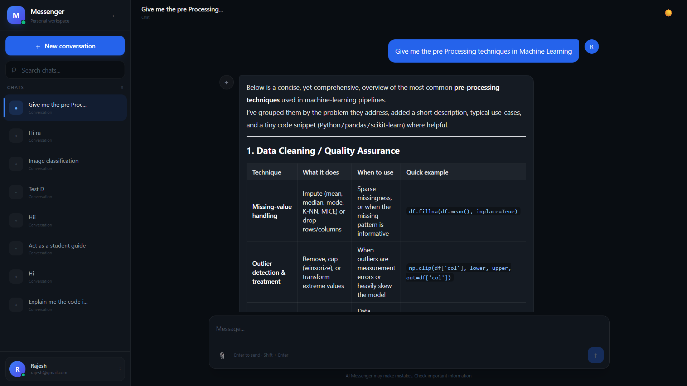
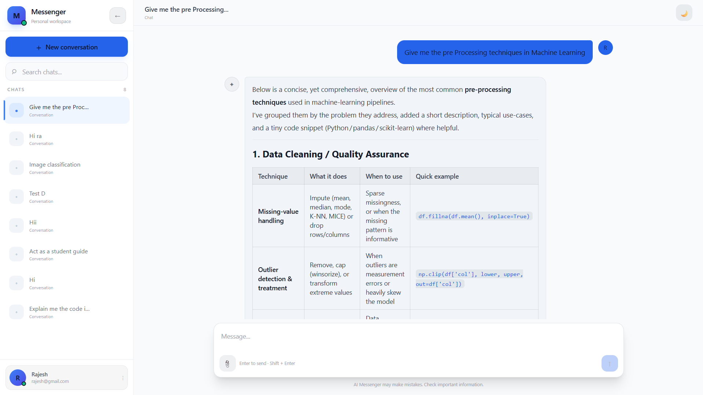
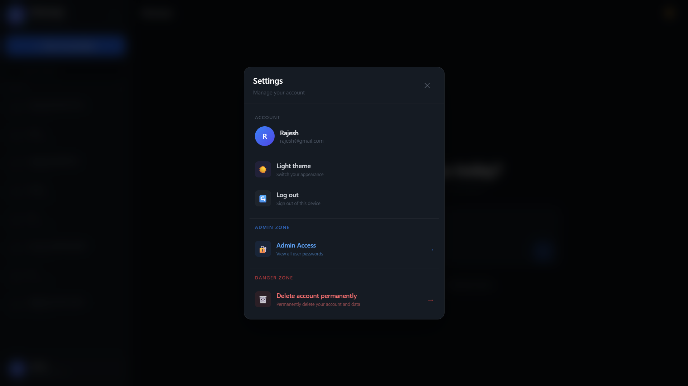

# 🤖 AI Messenger

<div align="center">



<br/>

## ✨ A Smarter Way to Chat with AI

### 💬 Conversations • 📎 Files • 🤖 AI • 🔐 Secure

<p>
A modern full-stack AI messaging application built with
<strong>React.js</strong>, <strong>Node.js</strong>, <strong>Express.js</strong>,
<strong>MongoDB</strong>, and <strong>Groq AI</strong>.
</p>

<br/>


</div>

---

## 🌟 What is AI Messenger?

**AI Messenger** is a full-stack AI-powered messaging platform designed to
make conversations with AI feel natural, organized, and personal.

Instead of being just a simple prompt-and-response chatbot, the application
combines AI conversations with authentication, persistent chat history,
file interaction, conversation management, account settings, and a polished
responsive interface.

> **Ask questions. Explore ideas. Upload files. Continue conversations.**

---

# 🎨 Built to Feel Like a Real Product

AI Messenger focuses on the complete user experience — from the first
screen to the final logout.

```text
        🏠 Discover
             ↓
        🔐 Sign In
             ↓
        💬 Start Chatting
             ↓
        🤖 Talk to AI
             ↓
        📎 Work with Files
             ↓
        📚 Manage Chats
             ↓
        ⚙️ Manage Account
             ↓
        🚪 Logout
```

Every part of the application is designed around this experience.

---

# 🏠 Home

<table>
<tr>
<td align="center">

### 🌙 Dark



</td>

<td align="center">

### ☀️ Light


</td>
</tr>
</table>

### The first impression

The home page gives users a simple entry point into the application with:

* 🤖 AI Messenger branding
* ✨ Clean modern design
* 🚀 Start Chatting action
* 🔐 Login access
* 💬 AI assistant preview
* 📱 Responsive interface
* 🌙 Dark theme
* ☀️ Light theme

---

# 🔐 Authentication

AI Messenger provides a complete authentication experience for users.

## 🔑 Login

<table>
<tr>
<td align="center">

### 🌙 Dark



</td>

<td align="center">

### ☀️ Light



</td>
</tr>
</table>

### Login includes

* 📧 Email authentication
* 🔐 Password authentication
* 👁️ Password visibility
* ✅ Form validation
* ⚠️ Error handling
* ⏳ Loading states
* 🔑 JWT authentication
* 📱 Responsive design

---

# 📝 Create Your Account

<table>
<tr>
<td align="center">

### 🌙 Dark



</td>

<td align="center">

### ☀️ Light



</td>
</tr>
</table>

### Registration includes

* 👤 Username creation
* 📧 Email validation
* 🔐 Secure password creation
* 👁️ Password visibility
* 📋 Password guidance
* ✅ Client-side validation
* ⚠️ Error handling
* ⏳ Loading states

---

# 💬 The Heart of AI Messenger

## 🤖 AI Chat

<table>
<tr>
<td align="center">

### 🌙 Dark



</td>

<td align="center">

### ☀️ Light



</td>
</tr>
</table>

The chat experience is the core of AI Messenger.

Users can create conversations, ask questions, receive AI-generated answers,
and continue conversations over time.

### 💡 Chat Features

* 💬 AI-powered conversations
* ➕ New conversations
* 📚 Conversation history
* 📝 Rename conversations
* 🗑️ Delete conversations
* 🔄 Regenerate AI responses
* 📎 Upload files
* 📄 Interact with file content
* 🔐 Protected conversations
* ⏳ AI loading states
* ⚠️ Error handling
* 📱 Responsive chat interface

---


# 📎 Files Meet AI

AI Messenger isn't limited to plain text conversations.

Users can upload files and interact with their content through the
conversation experience.

```text
📎 Upload
    ↓
📄 Process
    ↓
🧠 Understand
    ↓
💬 Ask Questions
    ↓
🤖 AI Response
```

### File interaction

* 📎 File upload
* 📄 File processing
* 💬 Ask questions about uploaded content
* 🔐 Protected file interaction
* ⚠️ Upload error handling
* ⏳ Processing states

---

# 🔄 One Answer Isn't Always Enough

Sometimes the first AI response isn't exactly what you want.

That's why AI Messenger includes **Regenerate**.

```text
🤖 AI Response
      │
      ▼
 🔄 Regenerate
      │
      ▼
 🤖 New Response
```

Users can quickly request another AI-generated response without manually
repeating the conversation.

---

# 📚 Your Conversations, Organized

AI Messenger treats conversations as persistent workspaces rather than
temporary messages.

### ➕ Create

Start a fresh conversation whenever you need one.

### 📝 Rename

Give conversations meaningful names.

### 📚 History

Return to previous conversations.

### 🗑️ Delete

Remove conversations you no longer need.

### 🔐 Protected

Your conversations are associated with authenticated users.

---

# ⚙️ Account & Settings

A dedicated settings area gives users control over their account and
application preferences.

### 👤 Account

View and manage account information.

### 🔐 Security

Change your password securely.

### 🎨 Appearance

Switch between:

**🌙 Dark Mode**
**☀️ Light Mode**

### 🔑 Administration

Access available administrative functionality.

### 🗑️ Account

Permanently delete the account when required.

---

# 🚪 Logout

Logout is part of the normal account experience.

<table>
<tr>
<div align="center">



</div>
</tr>
</table>

When the user chooses **Logout**:

```text
👤 User
   │
   ▼
🚪 Logout
   │
   ├── 🔑 Remove authentication token
   │
   ├── 🧹 Clear authenticated state
   │
   └── 🏠 Return to public experience
```

Simple, clear, and secure.

---

# 🛡️ Security

Security is built into the application flow.

### 🔐 JWT Authentication

Authenticated users receive a JWT used for protected requests.

### 🔒 Protected APIs

Private resources require authentication.

### 👤 User-Specific Data

User conversations and account resources are protected.

### 🗝️ Environment Secrets

Sensitive credentials such as AI and database keys are kept outside
the frontend source code.

### 🚪 Secure Logout

Authentication state is cleared when the user logs out.

---

# 🏗️ How Everything Connects

```text
                         🤖 AI MESSENGER
                                │
              ┌─────────────────┼─────────────────┐
              │                 │                 │
              ▼                 ▼                 ▼
          🔐 Auth            💬 Chat           📎 Files
              │                 │                 │
              └─────────────────┼─────────────────┘
                                │
                                ▼
                         🟢 Express.js
                                │
                    ┌───────────┴───────────┐
                    │                       │
                    ▼                       ▼
               🗄️ MongoDB              🤖 Groq AI
                    │                       │
                    └───────────┬───────────┘
                                │
                                ▼
                           ⚛️ React UI
```

---

# 🛠️ Technology Stack

<div align="center">

| Layer             | Technologies                         |
| :---------------- | :----------------------------------- |
| 🎨 Frontend       | React.js • JavaScript • Tailwind CSS |
| 🟢 Backend        | Node.js • Express.js                 |
| 🗄️ Database      | MongoDB                              |
| 🤖 AI             | Groq                                 |
| 🔐 Authentication | JWT                                  |
| 🌐 Communication  | REST APIs                            |
| 🔧 Tools          | Git • GitHub • VS Code • npm         |

</div>

---

# ✨ What Makes It More Than a Chatbot?

A basic AI application can be:

```text
Input → AI → Output
```

AI Messenger is:

```text
             👤 USER
                │
                ▼
          🔐 AUTHENTICATION
                │
                ▼
           💬 CONVERSATIONS
                │
       ┌────────┼────────┐
       │        │        │
       ▼        ▼        ▼
     🤖 AI     📎 FILES  📚 HISTORY
       │        │        │
       └────────┼────────┘
                │
                ▼
           🗄️ MONGODB
                │
                ▼
          ⚙️ ACCOUNT
                │
          ┌─────┴─────┐
          ▼           ▼
       🎨 Theme     🚪 Logout
```

It combines **AI + full-stack development + authentication + database +
file interaction + modern UI** into one application.

---

# 📱 Responsive Experience

AI Messenger is designed to provide a consistent experience across:

**💻 Desktop**
**🖥️ Laptop**
**📱 Tablet**
**📲 Mobile**

The interface adapts while keeping the important actions easy to access.

---

<div align="center">

# 🤖 AI Messenger

### **Ask. Explore. Create.**

<br/>

💬 **Smart Conversations**
📎 **File Interaction**
🔐 **Secure Authentication**
🎨 **Beautiful Themes**

<br/>

---

### Built with ❤️ using

**React.js • Node.js • Express.js • MongoDB • Groq AI**

<br/>

### ✨ A smarter way to chat with AI.

</div>
